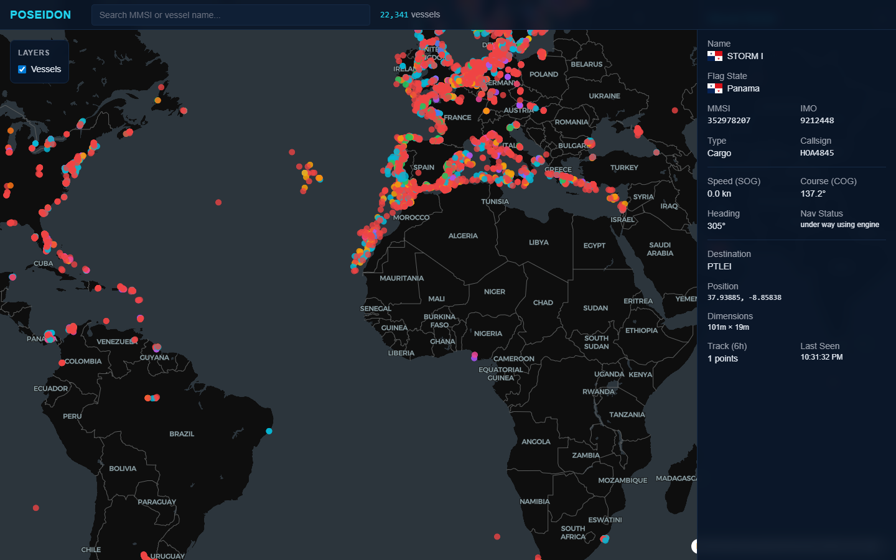

# Poseidon — Maritime Intelligence Platform

Real-time global vessel tracking and dark vessel detection powered by AIS data, PostGIS, and Deck.gl.




## Overview

Poseidon ingests live AIS (Automatic Identification System) data from [aisstream.io](https://aisstream.io), processes it through a high-throughput pipeline, and renders 20,000+ vessel positions on an interactive dark-themed map. It detects "dark vessels" — ships that stop transmitting AIS — using gap analysis and dead reckoning.

### Key Features

- **Real-time tracking** — WebSocket-driven live updates at ~100 messages/sec
- **20K+ vessel rendering** — Deck.gl WebGL layers with batched updates for 60fps performance
- **Dark vessel detection** — Automated AIS gap alerts with predicted positions
- **Search & filter** — Instant vessel lookup by name or MMSI
- **Vessel detail** — Click any vessel for metadata, track history, dimensions, and flag state
- **Country flags** — Automatic flag identification from MMSI Maritime Identification Digits

## Architecture

```
aisstream.io ──WebSocket──▸ FastAPI Ingestor
                                │
                          Redis (buffer + pub/sub)
                           │              │
                    Batch flush        WS broadcast
                    (every 2s)         (instant)
                           │              │
                        PostGIS        Browser
                     (vessel_positions)   │
                           │           Deck.gl
                      Dark vessel      MapLibre
                      detector         React 19
```

### Services

| Service      | Technology              | Port  | Purpose                          |
|-------------|-------------------------|-------|----------------------------------|
| **postgis** | PostGIS 16 + PostgreSQL | 5432  | Spatial database with triggers   |
| **redis**   | Redis 7 Alpine          | 6379  | Message buffer + pub/sub         |
| **backend** | FastAPI + Python 3.12   | 8000  | API, ingestion, processing       |
| **frontend**| React 19 + Vite 6       | 3000  | Map UI + real-time visualization |

## Quick Start

### Prerequisites

- [Docker](https://docs.docker.com/get-docker/) and Docker Compose
- An API key from [aisstream.io](https://aisstream.io) (free)

### Setup

1. **Clone the repo**
   ```bash
   git clone https://github.com/neelaypandya-ui/poseidon.git
   cd poseidon
   ```

2. **Configure environment**
   ```bash
   cp .env.example .env
   ```
   Edit `.env` and add your AIS API key:
   ```
   AISSTREAM_API_KEY=your_key_here
   ```

3. **Start all services**
   ```bash
   docker compose up -d --build
   ```

4. **Open the app**

   Navigate to [http://localhost:3000](http://localhost:3000)

   Vessels will begin appearing within seconds as AIS data streams in.

## API Endpoints

| Method | Path                           | Description                    |
|--------|--------------------------------|--------------------------------|
| GET    | `/api/v1/vessels`              | All current vessel positions   |
| GET    | `/api/v1/vessels/{mmsi}`       | Single vessel detail           |
| GET    | `/api/v1/vessels/{mmsi}/track` | Position history (default 6h)  |
| GET    | `/api/v1/alerts/dark-vessels`  | Active dark vessel alerts      |
| WS     | `/ws/vessels`                  | Real-time position stream      |

## Database Schema

| Table                      | Purpose                                          |
|---------------------------|--------------------------------------------------|
| `vessels`                  | Static vessel metadata (name, type, dimensions)  |
| `vessel_positions`         | Time-series position data (lat, lon, sog, cog)   |
| `latest_vessel_positions`  | Trigger-maintained current position per vessel    |
| `dark_vessel_alerts`       | AIS gap detections with predicted positions       |

## Tech Stack

**Backend:** FastAPI, asyncpg, Redis (hiredis), H3, Shapely, orjson, websockets

**Frontend:** React 19, TypeScript, Vite 6, Deck.gl 9, MapLibre GL, Zustand, TanStack Query, Tailwind CSS

**Infrastructure:** Docker Compose, PostGIS 16, Redis 7

## Performance Optimizations

- **Batched WebSocket updates** — Messages buffered in `requestAnimationFrame`, flushed as single store update (~1 Map clone/frame instead of 50-100/sec)
- **Split layer memos** — Vessel, track, and dark alert layers recompute independently (pulse animation doesn't rebuild 20K vessel layer)
- **Scalar subscriptions** — TopBar subscribes to `vesselCount` number instead of full vessel Map
- **Memoized callbacks** — Stable `onViewStateChange`/`getCursor` references prevent unnecessary DeckGL re-renders

## License

MIT
